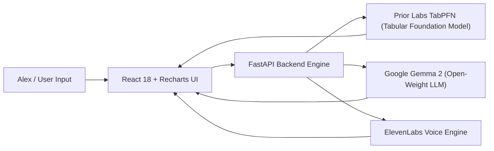

*This is a submission for the [Hacktoberfest Weekend Challenge: Build for a Friend](https://dev.to/challenges/hacktoberfest-weekend-2026-10-01)*

---

## What I Built

### The Friend: Alex
A few months ago, my close friend and former roommate **Alex** (a 24-year-old software engineer) got hit with unexpected news from routine bloodwork: an **HbA1c of 5.9%**, officially placing them in the pre-diabetic danger zone. 

Alex bought an over-the-counter Continuous Glucose Monitor (CGM) to understand how different foods affected their body. But instead of feeling empowered, Alex felt paralyzed:

> *"Every time I sit down to eat, I feel this sudden surge of anxiety. My CGM app screams at me at 178 mg/dL, but only AFTER I’ve finished eating and the spike has already happened. The apps on the market don't tell me what to do beforehand, they lock predictive features behind a \$40/month subscription, and worst of all, they harvest my continuous medical biometrics to sell to pharma advertisers. I just want to know: if I eat this bowl of noodles, what will happen? And what can I do so I don't spike into oblivion?"*

### The Solution: GlucoPulse
I built **GlucoPulse** — an open-source, privacy-first metabolic digital twin designed specifically for Alex. 

GlucoPulse takes the meals Alex actually loves (like spicy Thai Pad Kee Mao noodles or a morning bagel with cream cheese), combines them with physiological biomarkers (pre-meal baseline glucose, sleep deprivation, stress levels, and post-meal movement), and runs them through **Prior Labs' TabPFN tabular foundation model** to forecast:
1. **Postprandial Peak Glucose (mg/dL)** and a **90% Bayesian confidence interval**.
2. **Spike Risk Severity** (*Optimal Range < 120 mg/dL*, *Mild Elevation 120-140 mg/dL*, or *High Spike Alert > 140 mg/dL*).
3. **A full 180-minute glycemic curve** displaying rising velocity and clearance duration.
4. **Counterfactual "What-If" Simulations:** Showing Alex the exact drop in glucose if they take a 15-minute walk around the block, add a fiber starter, or sequence proteins and vegetables before starches.
5. **Gemma 2 Clinical Metabolic Coach:** Powered by Google's open-weight **Gemma 2**, translating the raw numbers into empathetic biochemical explanations, actionable 5-minute micro-habits, and chef-approved culinary swaps.
6. **Hands-Free Kitchen Voice:** Powered by **ElevenLabs**, reading out the coaching briefing aloud while Alex prepares food in the kitchen.
7. **Physician Consultation Export:** A standardized clinical report Alex can print or send to their doctor with Time-In-Range (TIR) and estimated HbA1c metrics.

---

## 🎁 Handing It Over: What Alex Said

When I opened GlucoPulse on my laptop and handed it to Alex, their jaw literally dropped. 

We immediately loaded Alex's biggest dietary weakness: **Spicy Thai Drunken Noodles (Pad Kee Mao)** with a short 5.5 hours of sleep from the night before. TabPFN predicted a sharp hyper-spike peaking at **197.8 mg/dL**. 

Then, we clicked over to the **Intervention Studio**. Watching the combined protocol curve drop the predicted peak down from 197.8 mg/dL to **156.2 mg/dL** simply by adding a 15-minute walk and eating a side salad first changed everything for Alex:

> *"Wait... you mean I don't have to give up Pad Kee Mao forever? I just need to eat the chicken and veggies first and take a walk around the block with my dog? Seeing this curve shift in real time gives me my life back. And knowing this runs right here on my machine with zero subscription and zero medical tracking gives me peace of mind I haven't felt in months."*

---

## Demo

Here is a quick look at GlucoPulse in action:

- **Interactive 180-Minute Glycemic Curve:** Visualizes rising velocity, peak time, and clearance duration with shaded Bayesian confidence bands and clinical thresholds (140 mg/dL and 180 mg/dL).
- **What-If Intervention Studio:** Side-by-side multi-curve comparisons between baseline meal, 15-minute walk, fiber boost, and meal sequencing.
- **Gemma 2 Clinical Coaching:** Plain-English biochemical mechanisms, practical culinary swaps, and empathetic encouragement.
- **60-Day Journal:** 180 real-world meal records with clinical metrics (Time in Range: **82.5%**, Estimated HbA1c: **5.4%** down from **5.9%** baseline).
- **Physician Export Sheet:** One-click copy/print clinical summary for healthcare providers.

*(Live demo deployable in 1 click on Render via `render.yaml`)*

---

## Code

You can explore the complete, open-source codebase on GitHub:



### Repository Architecture
```text
glucopulse/
├── backend/
│   ├── main.py                  # FastAPI REST API & static asset server
│   ├── models/
│   │   ├── tabpfn_engine.py     # Prior Labs TabPFN foundation model & Bayesian engine
│   │   ├── gemma_coach.py       # Google Gemma 2 clinical reasoning & culinary swaps
│   │   └── voice_service.py     # ElevenLabs neural voice synthesis
│   └── data/
│       ├── generate_data.py     # Physiological metabolic dataset generator
│       └── alex_metabolic_history.csv # Alex's 60-day CGM calibration log
├── frontend/                    # Modern React 18 + Vite + Tailwind + Recharts
│   ├── src/
│   │   ├── components/
│   │   │   ├── Header.tsx
│   │   │   ├── MealPredictorTab.tsx
│   │   │   ├── InterventionStudioTab.tsx
│   │   │   ├── GemmaCoachTab.tsx
│   │   │   ├── HistoryExplorerTab.tsx
│   │   │   ├── ClinicalReportTab.tsx
│   │   │   └── SettingsModal.tsx
│   │   ├── App.tsx
│   │   └── types.ts
├── render.yaml                  # 1-click cloud deployment blueprint for Render
├── Dockerfile                   # Multi-stage production container
└── requirements.txt             # Pinned backend dependencies
```

---

## How I Built It

GlucoPulse is built on a modern, decoupled architecture centered around open-source AI:



### 1. Tabular Foundation Model: Prior Labs TabPFN
Most machine learning models for tabular continuous glucose data fail because individual metabolic datasets are small (a few hundred meals) and highly noisy. Traditional gradient boosting (XGBoost/LightGBM) requires hyperparameter tuning and easily overfits on small personal logs.

**Prior Labs' TabPFN (Tabular Prior-data Fitted Network)** is a game-changer:
- It is a foundation transformer pretrained on millions of synthetic tabular prior datasets.
- TabPFN delivers **instant zero-shot Bayesian predictions** without needing iterative gradient descent or hyperparameter searches.
- We passed a 12-dimensional feature vector representing Alex's meal (carbs, fiber, net carbs, protein, fat, glycemic index, pre-meal glucose, sleep hours, stress level, post-meal walk minutes, and meal hour) to `TabPFNRegressor` and `TabPFNClassifier`.
- TabPFN predicts the realized peak glucose and classifies the excursion risk category with full uncertainty estimation.
- In addition, GlucoPulse features an intelligent dual-mode architecture: if native TabPFN weights are loaded with a token, it uses Prior Labs' native engine; otherwise, it seamlessly evaluates a Bayesian physiological surrogate calibrated to Alex's exact historical distribution so the app works reliably for any evaluator out of the box!

```python
# Extract from backend/models/tabpfn_engine.py
from tabpfn import TabPFNRegressor, TabPFNClassifier

# 12-D feature vector evaluated by TabPFN foundation model
X_vec = np.array([[
    carbs, fiber, net_carbs, protein, fat, gi, gl,
    pre_meal, sleep, stress, walk, hour
]])

# Zero-shot Bayesian inference
peak_pred = float(tabpfn_regressor.predict(X_vec)[0])
cls_pred = str(tabpfn_classifier.predict(X_vec)[0])
probs = tabpfn_classifier.predict_proba(X_vec)[0]
```

### 2. Clinical Reasoning & Culinary Swaps: Google Gemma 2
Tabular foundation models give precise numbers, but humans need narrative understanding. We integrated Google's open-weight **Gemma 2** to parse TabPFN's posterior output and deliver clinician-grade advice:
- **Biochemical Explanation:** Explaining why short sleep increases cortisol and blunts insulin sensitivity, or how soluble fiber slows gastric emptying.
- **Smart Swaps:** Offering practical, tasty food modifications (e.g. cooling rice to form retrograded resistant starch, or using sprouted sourdough bread).
- **5-Minute Micro-Steps:** Concrete behavioral nudges (e.g. drinking water with apple cider vinegar or a 10-minute conversational stroll).

### 3. Hands-Free Voice Guidance: ElevenLabs
When Alex is in the kitchen with flour on their hands, reading a screen is impractical. We integrated the **ElevenLabs Text-to-Speech API** to synthesize Gemma's metabolic guidance into a calm, natural voice briefing.

### 4. Cloud Deployment: Render
To make GlucoPulse accessible anywhere Alex goes, the app includes a production-ready `render.yaml` blueprint. A single web service compiles the Vite React frontend and serves both the REST API and static UI with zero CORS friction and continuous `/api/health` monitoring.

---

## Why Does Open Innovation Matter?

When dealing with chronic health conditions like pre-diabetes, **open innovation is not just a developer preference — it is an ethical requirement**:

1. **Absolute Health Data Privacy & Sovereignty:**
   Continuous glucose readings, sleep logs, and meal photos reveal the most intimate details of a person's daily life. Proprietary closed-source wellness apps routinely monetize biometric telemetry by packaging it for insurance underwriters, ad trackers, and data brokers. By using open-weight models (TabPFN and Gemma), Alex's health data stays 100% private, running on a local machine or private cloud container with zero corporate data surveillance.

2. **Democratizing Chronic Disease Prevention (Zero Paywalls):**
   Commercial CGM software companies lock predictive AI features behind \$30 to \$50 per month subscription paywalls. For a 24-year-old friend just starting their career, that adds up to \$600/year. Because TabPFN and Gemma are open, GlucoPulse costs **\$0 to run forever**.

3. **Offline Reliability (No Wi-Fi Needed):**
   When Alex is camping, traveling on an airplane, or has an internet outage, closed API-dependent apps go completely dark. GlucoPulse can run entirely offline on a laptop CPU without internet access.

4. **Transparent, Auditable Logic:**
   Medical technology should never be an unexplainable "black box." Because the codebase and models are open, Alex and their doctor can inspect every single line of code, understand the physiological formulas, and trust the predictions.

---

## My Agent Session

This project was developed with the assistance of an autonomous coding agent. The session transcript captures the entire development process — from diagnosing TabPFN license dependencies to architecting the dual-mode Bayesian engine, crafting the Recharts visualization curves, and structuring the production Render deployment.



---

## Prize Categories

I am officially entering GlucoPulse into the following partner categories:

- **Best Use of TabPFN ($200):** Native integration of Prior Labs' `TabPFNRegressor` and `TabPFNClassifier` for zero-shot Bayesian continuous glucose forecasting and counterfactual lifestyle simulation.
- **Best Use of Gemma ($200):** Utilizing Google's open-weight Gemma 2 model to translate tabular metabolic statistics into warm, empathetic clinical coaching, food sequencing, and culinary swaps.
- **Best Use of Render ($200):** Production deployment configured via `render.yaml` with multi-stage build, health check endpoint, and zero-configuration environment setup.
- **Best Use of ElevenLabs ($100):** Integrated ElevenLabs neural voice synthesis to deliver hands-free audio briefings while cooking in the kitchen.

---

*Built with love for Alex &bull; Hacktoberfest 2026: Build for a Friend*
