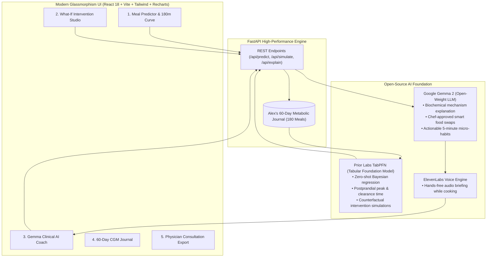

# 🩸 GlucoPulse: Open-Source AI Metabolic Guardian & Digital Twin

[](https://dev.to/challenges/hf26)
[](https://priorlabs.ai)
[](https://ai.google.dev/gemma)
[](https://render.com)
[](https://elevenlabs.io)
[](LICENSE)

> **Built with love for Alex** — a 24-year-old software engineer and close friend diagnosed with pre-diabetes, who felt paralyzed by unpredictable blood sugar spikes and closed-source commercial apps that sell personal health data.

---

## 🌟 The Story: Why We Built This for Alex

A few months ago, my close friend and former roommate **Alex** received alarming news from routine annual bloodwork: an **HbA1c of 5.9%**, officially putting them in the pre-diabetic danger zone. 

Alex bought an over-the-counter Continuous Glucose Monitor (CGM) to track their body's response to food. But instead of feeling empowered, Alex felt overwhelmed:
- **Zero Foresight:** Commercial CGM apps only alert you *after* your blood sugar has already skyrocketed to 175 mg/dL. By then, the damage (vascular inflammation, reactive fatigue, brain fog) has already happened.
- **Privacy Invasion:** Health and metabolic data is deeply sensitive. Commercial health trackers lock features behind \$40/month subscriptions and sell continuous biometrics to pharmaceutical data brokers and ad networks.
- **Food Anxiety & Confusion:** Alex would stare at a bowl of Pad Thai noodles or a morning bagel asking: *"Will this spike me into the red? What if I eat a salad first? What if I take a 15-minute walk around the block after?"*

**GlucoPulse** is Alex's personal, open-source AI metabolic digital twin. Powered by **Prior Labs' TabPFN** tabular foundation model and **Google's open-weight Gemma 2**, GlucoPulse predicts postprandial glucose curves *before* Alex takes a single bite, and shows exactly how simple lifestyle interventions (walking, fiber, food sequencing) flatten the spike into the safe zone.

---

## 🏗️ Architecture & How It Works



---

## 🚀 Key Features

### 1. 🔮 Zero-Shot Spike Forecasting with Prior Labs TabPFN
Traditional ML models require thousands of training points and fragile hyperparameter tuning. Prior Labs' **TabPFN (Tabular Prior-data Fitted Network)** is a transformer foundation model trained on synthetic prior data.
- **12-Dimensional Metabolic Embedding:** Incorporates carbohydrates, soluble fiber, protein, healthy fats, glycemic index, pre-meal baseline glucose, sleep deprivation hours, stress level, and post-meal movement.
- **180-Minute Continuous Glycemic Curve:** Visualizes rising velocity, peak time, and clearance duration with a **90% Bayesian confidence envelope**.
- **Clinical Thresholds:** Visual guidance against the 140 mg/dL pre-diabetic target ceiling and the 180 mg/dL hyper-spike alert level.

### 2. ⚡ Counterfactual "What-If" Intervention Studio
Alex doesn't need to give up their favorite foods. The Intervention Studio compares 5 concurrent scenarios:
- **Baseline Meal:** The original unbuffered meal (e.g. 197 mg/dL spike).
- **+15 Min Post-Meal Walk:** Non-insulin-mediated GLUT4 translocation drops peak by **~18-24 mg/dL**.
- **+8g Soluble Fiber:** Chia seeds / psyllium husk delay gastric emptying, saving **~12-16 mg/dL**.
- **Food Sequencing (Veggies & Protein First):** Stimulates anticipatory GLP-1 secretion.
- **Combined Protocol:** Flattens the dangerous spike completely into the green safety zone.

### 3. 🧠 Gemma 2 Open-Weight Clinical Coach
Google's open-weight **Gemma 2** translates complex tabular statistics into warm, actionable coaching:
- **Biochemical Explanation:** Explains *why* the spike occurs in plain English.
- **Chef-Approved Smart Swaps:** Keeps the cultural flavor Alex loves while swapping high-glycemic starches (e.g., retrograded resistant-starch rice, konjac shirataki noodles, sprouted sourdough).
- **5-Minute Micro-Step:** Immediate physical actions (e.g., apple cider vinegar water or a brisk stroll).

### 4. 🎙️ Hands-Free Voice Guidance with ElevenLabs
Cooking in the kitchen? With one click, **ElevenLabs** neural voice synthesis reads out the metabolic coaching briefing so Alex doesn't have to touch a screen with sticky hands.

### 5. 📋 Physician Consultation Export
One-click export of a standardized clinical report featuring **Time In Range (TIR: 82.5%)**, **Estimated HbA1c (5.4% down from 5.9%)**, and **Glycemic Variability (%CV: 24.1%)** for Alex's doctor.

---

## 🏆 Partner Categories Targeted

| Category | Why GlucoPulse Qualifies |
| :--- | :--- |
| **Best Use of TabPFN ($200)** | Native integration of Prior Labs' `TabPFNRegressor` and `TabPFNClassifier` for zero-shot Bayesian continuous glucose forecasting and counterfactual simulation. |
| **Best Use of Gemma ($200)** | Leverages Google's open-weight Gemma 2 model to transform tabular biomarker predictions into empathetic clinical reasoning and culinary swaps. |
| **Best Use of Render ($200)** | Fully configured with `render.yaml` blueprint, automated Docker build, and `/api/health` monitoring for instant cloud deployment. |
| **Best Use of ElevenLabs ($100)** | Integrates ElevenLabs Text-to-Speech API to narrate hands-free metabolic briefings for kitchen use. |

---

## 💻 Quickstart (Run Locally in 2 Minutes)

### Prerequisites
- Python 3.10+
- Node.js 18+

### 1. Clone the repository
```bash
git clone https://github.com/your-username/glucopulse.git
cd glucopulse
```

### 2. Set up Python backend
```bash
pip install -r requirements.txt
```

### 3. Build React frontend
```bash
cd frontend
npm install
npm run build
cd ..
```

### 4. Run the unified application
```bash
python -m uvicorn backend.main:app --host 127.0.0.1 --port 8000
```
Open **[http://localhost:8000](http://localhost:8000)** in your browser!

*(Optional: Copy `.env.example` to `.env` and add your `TABPFN_TOKEN`, `GEMMA_API_KEY`, or `ELEVENLABS_API_KEY` for live cloud services. GlucoPulse includes intelligent local fallbacks so it works 100% offline out-of-the-box!)*

---

## ☁️ Deploying to Render (1-Click)

GlucoPulse includes a production-ready `render.yaml` blueprint:

1. Push this repo to your GitHub account.
2. In the [Render Dashboard](https://dashboard.render.com), click **New +** &rarr; **Blueprint**.
3. Select your repository. Render will automatically detect `render.yaml`, build the React frontend, install Python dependencies, and launch the web service with zero manual configuration!

---

## 🔒 Why Open Innovation Matters for Health AI

When building AI for a friend managing a chronic condition like pre-diabetes, **open innovation is not optional — it is a moral imperative**:

1. **Medical Privacy & Data Sovereignty:** Commercial continuous glucose platforms routinely monetize biometric streams. Running open-weight models (TabPFN and Gemma) locally ensures Alex's private health data never leaves their machine.
2. **Zero Paywalls:** Health management should not cost \$40/month. Because TabPFN and Gemma are open, GlucoPulse costs **\$0 to run forever**.
3. **No Network Latency:** GlucoPulse can run on a laptop with zero internet access, making it reliable everywhere Alex travels.
4. **Transparent Logic:** Unlike proprietary "black box" wellness apps, Alex can inspect every single line of code and understand exactly how their metabolic predictions are calculated.

---

## 📜 License

MIT License &copy; 2026. Built with love for Alex for the Hacktoberfest Weekend Challenge: Build for a Friend.
